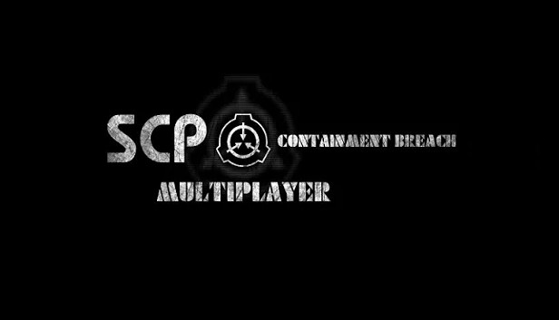

# SCP-CBM-RCE

A few days ago, I found a buffer overflow vulnerability in SCP:CBM that allows for arbitrary remote code execution after you subscribe to an addon on the workshop (or connecting to a server that has the RCE addon), and playing the game.

https://drbloop.dev/blog/one-click-remote-code-execution-in-scp-containment-breach-mutiplayer

https://github.com/user-attachments/assets/743355f9-282e-49b6-8dca-9f688a277993

